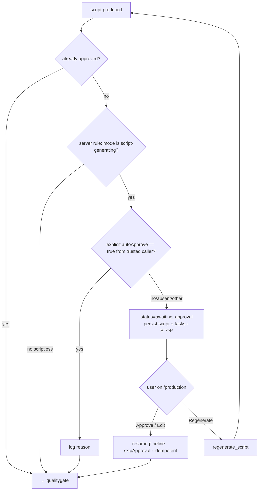
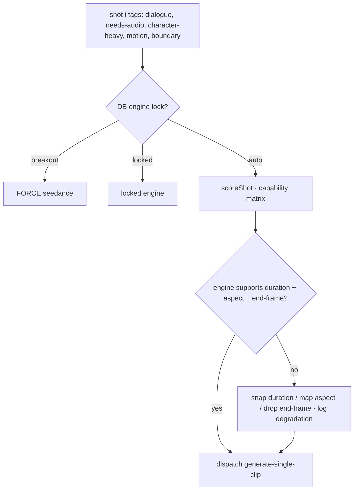
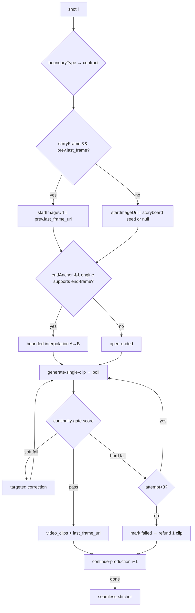

# Creation Pipeline — authoritative design + cleanup plan

Status: **design of record.** Consolidates the four-domain inventory (creation
modes, engines, continuity/frame configs, stage machine) with the live engine
audit (2026-06-27). This is the single source of truth for the creation
pipeline; reconcile code to it, not the reverse.

> Audit note: every engine + support model below was verified live against the
> Replicate API on 2026-06-27 (all resolve, all healthy). Slugs here are the
> **live** `generate-single-clip` route labels — they win over `model-catalog.ts`
> where the two disagree.

---

## 1. The demand

### Creation modes (`src/types/video-modes.ts`)

| Mode | Script? | Required input | Router handler | Pipeline |
|---|---|---|---|---|
| text-to-video | ✅ multi-shot | prompt | handleCinematicMode | hollywood (seedance if breakout/engine) |
| image-to-video | ✅ | image + prompt | handleCinematicMode | hollywood |
| b-roll | ✅ | prompt | handleCinematicMode | hollywood |
| avatar (direct) | ❌ verbatim TTS | avatar image + script | handleAvatarDirectMode | generate-avatar-direct (Kling) |
| avatar (cinematic) | ✅ | concept + avatar image | handleAvatarCinematicMode | seedance |
| video-to-video | ❌ | source video + style | handleStyleTransferMode | stylize-video |
| motion-transfer | ❌ | source video + target image | handleMotionTransferMode | motion-transfer |

Feature flags (not modes): `isBreakout` (→ seedance), `crossoverTemplateSlug`
(50 VFX templates), training-video wizard (→ avatar).

### Engines — LIVE slugs (audited 2026-06-27)

| Engine | Live slug | Durations | Audio | Img→Vid | End-frame A→B | Runs |
|---|---|---|---|---|---|---|
| Kling V3 *(default)* | `kwaivgi/kling-v3-video` | 5/10/15 | ✅ | ✅ | ✅ | 329k |
| Seedance 2.0 | `bytedance/seedance-2.0` | 5/10/12 | ✅ | ✅ | ✅ (last_frame_image) | 886k |
| Wan 2.5 *(free)* | **`wan-video/wan-2.5-t2v`** | 5/10 | ❌ | ✅ | ❌ | 36k |
| Veo 3 Fast | `google/veo-3-fast` | 4/6/8 | ✅ | ✅ | ❌ | 203k |
| Runway Gen-4 | `runwayml/gen4-turbo` | 5/10 | ❌ | ✅ | ✅ | 108k |
| Sora 2 | `openai/sora-2` | 4/8/12 | ✅ | ✅ | ❌ | 334k |

> ⚠️ Reconciliation: `model-catalog.ts` lists Wan as `wan-ai/...` — **stale.**
> Live + verified = `wan-video/wan-2.5-t2v`. Fix the catalog to match.

Support models (audited): `black-forest-labs/flux-1.1-pro-ultra`,
`black-forest-labs/flux-1.1-pro` (scene/start/portrait images),
`bytedance/latentsync` (universal lip-sync), `minimax/speech-2.6-turbo` (TTS),
`magpai-app/cog-ffmpeg` @ `efd0b79b…` (stitch + finishing).

Engine selection: DB `movie_projects.video_engine` lock → `routing_map[shot].engine`
per-shot override → `_shared/shot-engine-router.ts` auto-score (dialogue→Kling,
character→Runway, motion→Seedance, audio/establishing→Veo/Sora, free→Wan).

### Continuity (`src/lib/video/continuity/*`)
Identity Bible (identityDNA, canonicalStillUrl, faceEmbedding, wardrobeDNA,
antiMorphPrompts) + StyleAnchor. Character Lock {strict|loose}. Boundary
contracts CONTINUOUS / MATCH / LOCATION_CHANGE / INTRO — per-dimension
hard|soft|off across identity/wardrobe/boundary/temporal/color/vlm + carryFrame +
overlapMs. Frame chaining via startImageUrl (prev last frame) / endImageUrl
(bounded interpolation). Cast ≤8 with VoiceProfile per character.

### Formats
Aspect 16:9(def)/9:16/1:1/21:9/4:5/4:3 (engine-mapped). Clips 1–20 (def 6),
duration {5,10,…}. Quality 720p/1080p/4K, fps 24/30/60; `qualityOptions`
{upscale4k +10cr, fps60 +5cr, autoRetake} applied **once at finalize**.

---

## 2. Designed pipeline

```mermaid
flowchart TD
  ENTRY[Studio / Training / Crossover / Editor] --> MR{{mode-router\nNORMALIZE → canonical request}}
  MR --> CLS{Script-generating?\n(server-derived from mode)}
  CLS -->|NO scriptless| DIRECT[avatar-direct / video-to-video / motion-transfer]
  CLS -->|YES cinematic| PREP[1 PREPRODUCTION\nscript + identity bible]
  PREP --> GATE{{2 APPROVAL GATE — FAIL-CLOSED}}
  GATE -->|approved| QG[3 QUALITY GATE]
  GATE -->|regenerate| PREP
  QG --> ASSET[4 ASSETS\nvoice / music / sfx / storyboard seeds]
  ASSET --> PROD[5 PRODUCTION LOOP\nper-shot · router · continuity]
  DIRECT --> FIN
  PROD --> FIN
  FIN[seamless-stitcher → qualityOptions finalize → completed]
  FIN -. realtime .-> ENTRY
```

### Fig. 3 — fail-closed approval gate *(the spend-leak fix)*

**Why iron-clad:** every cinematic run pauses unless the server explicitly says
otherwise. A forgotten flag (the Crossover/Template/Studio leak) now safely
pauses instead of silently spending. Only opt-out is `autoApprove:true` from a
trusted caller.

### Fig. 4 — per-shot engine router (capability-agnostic)


### Fig. 5 — production loop + continuity


---

## 3. Cleanup actions (this lane owns)

1. **Fail-closed approval gate** (Fig. 3) — make pausing **server-derived from
   mode**, not a client flag. Closes the Crossover/Template/Studio spend-leaks.
   *Open decision: do scriptless/quick-gen modes also pause, or stay exempt?*
2. **Engine-slug reconciliation** — fix `model-catalog.ts` Wan slug to
   `wan-video/wan-2.5-t2v`; add a FE↔BE parity check so they can't drift.
3. **Delete dead code** — the `python/**` engine is confirmed dead (live path is
   edge fns + Replicate). Remove it and any orphaned references.
4. **Capability-driven dispatch** — fold the per-shot CAP check (Fig. 4) so a 7th
   engine is data, not new branches.
5. **Quality post once, at finalize** — keep 4K/60fps as a single finalize pass,
   charged on actual output (already true in the new Finishing Studio).

## 4. Production-superiority layers already shipped (this session)

These plug into the design above and are **live in prod**:
- **Finishing Studio** — house-grade + 4K + 60fps finalize pass (Fig. 2 FIN).
- **Per-shot model router** — Fig. 4, `routing_map` + `route-shots`.
- **Universal lip-sync** — LatentSync over any engine's output (ASSETS/finalize).
- **Storyboard/previz gate** — FLUX keyframes → `scene_images` seed (ASSETS).
- **Cast & Worlds library** — reusable identity assets (`director_cast`) feeding
  the Identity Bible.
