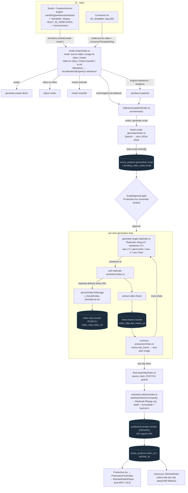
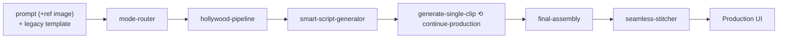
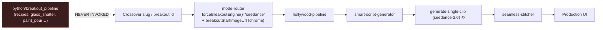
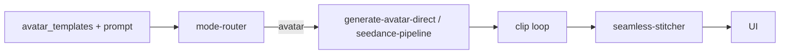
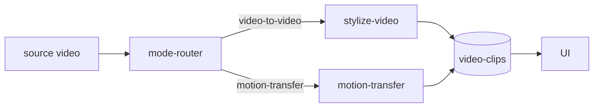
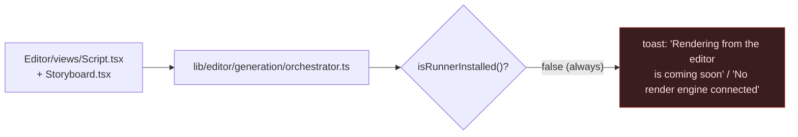

# 00 — Pipeline Flowcharts & Component Connection Map

> Evidence-based reconstruction of Genesis Director's **real** creation pipeline,
> traced from code (not from the design docs). Every edge below is backed by a
> `file:line` citation in §"Component connection map" or in `02-STAGES.md`.

## TL;DR — the shape is NOT what the brief assumed

The brief's mental model is:

```
input + template → Python engine → scripting → storyboard → file gen → retrieval → stitching → studio → UI
```

The **actual** live shape is a chain of **Supabase edge functions calling cloud
APIs (Replicate / OpenAI)**. There is **no Python engine in the live path** — the
`python/breakout_pipeline/` CLI is standalone, unwired, and cannot even run in this
repo (fails at `import numpy`; see `02-STAGES.md §7`). The "storyboard" and "script
page" the brief describes live in **two parallel surfaces** (live `Production.tsx`
vs. a dormant `Editor/`), only one of which actually renders.

Real master path:

```
Studio (CreationHub)  →  mode-router  →  hollywood-pipeline
   →  smart-script-generator (script JSON, persisted)
   →  [per-shot loop] generate-single-clip → Replicate → poll-replicate-prediction
        → persistVideoToStorage (video-clips bucket) → extract-video-frame (last_frame_url)
        → continue-production (chains next shot's start image)
   →  final-assembly (claims stitch) → seamless-stitcher (Replicate ffmpeg "cog")
        → published-renders bucket (24h signed URL) → movie_projects.video_url
   →  Production.tsx UI playback  (+ Library client-side sequential fallback)
```

---

## Master flowchart (live pipeline)



---

## Per-type flowcharts (where the flow differs)

### A. Text-to-video / Image-to-video / B-roll (the canonical path)
Same as master. `image-to-video` additionally seeds shot-0 with the uploaded
reference image; `b-roll` uses the same chain with shorter shot counts. Engine is
DB-locked on `movie_projects.video_engine` (`generate-single-clip:1187-1209`).



### B. Crossover / Breakout (4th-wall VFX)
Diverges only at the **front**: input is a `vfx_templates` slug (Crossover) or a
`BREAKOUT_TEMPLATES` id (Studio). `mode-router` forces the engine to **seedance**
via `forceBreakoutEngine()` and injects a `breakoutStartImageUrl` (platform chrome).
After that it is the **identical** hollywood-pipeline chain. **The VFX is emergent
from the cloud model + prompt + chrome image — NOT from the Python recipes.**



### C. Avatar
`mode:avatar` → `generate-avatar-direct` (Kling) or `seedance-pipeline`. Consumes
`avatar_templates` (own registry), not the template registry. Re-joins the clip /
stitch chain for multi-shot avatar scenes.



### D. Video-to-video / Motion-transfer
Single-function detours that do **not** run the script→storyboard stages — they
transform an existing input video and persist a clip directly.



### E. Editor NLE (DORMANT — design-complete, cannot render)
Separate surface with its own script page + storyboard. The render runner
(`installJobRunner`) has **zero call sites**, so every render CTA dead-ends.



### F. Production `ProjectType` (DEAD — test-only)
`cinematic-trailer | social-ad | narrative-short | documentary | explainer` and
`PROJECT_TYPES` are referenced only by tests; no UI picker sets them.


---

## Component connection map (with citations)

| # | From → To | Mechanism | Evidence |
|---|-----------|-----------|----------|
| 1 | CreationHub → mode-router | `supabase.functions.invoke('mode-router')` | `src/pages/Studio.tsx:444`; `src/components/studio/CreationHub.tsx:601` |
| 2 | Crossover → mode-router | invoke w/ `crossoverTemplateSlug` | `src/pages/Crossover.tsx:561-568` |
| 3 | mode-router → branches | `switch(mode)` | `supabase/functions/mode-router/index.ts:170,520-593` |
| 4 | breakout → seedance lock | `forceBreakoutEngine()` | `mode-router/index.ts:385`; `_shared/breakout-guardrails.ts:38,81` |
| 5 | mode-router → hollywood-pipeline | `fetch(.../hollywood-pipeline)` | `mode-router/index.ts:946,1208-1217` |
| 6 | hollywood-pipeline → smart-script-generator | inner invoke | `hollywood-pipeline/index.ts:1260,1404` |
| 7 | script persist | update `movie_projects` | `hollywood-pipeline/index.ts:1535-1553` |
| 8 | script read (UI) | `pending_video_tasks.script.shots` / `JSON.parse(generated_script)` | `src/pages/Production.tsx:553-576,592-635` |
| 9 | script render (UI) | `<ScriptApproval>` / `<ScriptReviewPanel>` | `Production.tsx:1471-1482,1531-1539` |
| 10 | per-clip gen | Replicate predictions (6 engines) | `generate-single-clip/index.ts:195-616,1654-1713` |
| 11 | clip persist | download Replicate → upload `video-clips` | `_shared/video-persistence.ts:22-90`; `generate-single-clip:829-910` |
| 12 | frame chain | `extract-video-frame` → `last_frame_url` | `poll-replicate-prediction/index.ts:171-258` |
| 13 | chain consume | 3-tier last-frame lookup | `continue-production/index.ts:725-790` |
| 14 | stitch trigger | last clip → `final-assembly` | `continue-production/index.ts:141-177` |
| 15 | stitch claim | atomic TOCTOU guard | `final-assembly/index.ts:159-237` |
| 16 | stitch run | `buildSeamlessCommand()` → Replicate ffmpeg cog | `_shared/seamless-command.ts:180-523`; `seamless-stitcher/index.ts:1185-1260` |
| 17 | transitions | `xfade` + `acrossfade` | `seamless-command.ts:321-342` |
| 18 | final store | private `published-renders`, 24h signed URL | `seamless-stitcher/index.ts:110,1264-1307` |
| 19 | final write | `movie_projects.video_url` | `seamless-stitcher/index.ts:1001-1013`; `final-assembly:279-311` |
| 20 | final playback | `ProductionFinalVideo` → `BrandedVideoPlayer` | `Production.tsx:1687-1690`; `BrandedVideoPlayer.tsx:263-322` |
| 21 | client fallback | `StitchedVideo` per-clip sequential | `src/pages/Library.tsx:353-419` |
| ✗ | python engine | **no invocation anywhere** | grep `breakout_pipeline\|child_process\|Deno.Command` over `src/`+`supabase/` = 0 hits |

### Storage buckets touched
| Bucket | Public | Holds | Created |
|--------|--------|-------|---------|
| `video-clips` | ✅ | persisted clip MP4s, voice/music audio | `20260106114819…sql` |
| `temp-frames` | ✅ | extracted last frames (chaining) | `20260105040955…sql` |
| `scene-images` | ✅ | scene reference images | `20260104223545…sql` |
| `thumbnails` | ✅ | project/clip thumbnails | `20260104043425…sql` |
| `character-references`, `avatars` | owner-write | identity refs | `20260114004755…sql` |
| `voice-tracks` | ❌ private | voice audio | `20260516225342…sql` |
| `published-renders` | ❌ private | **final stitched film (24h signed URL)** | `20260612010000…sql` |
